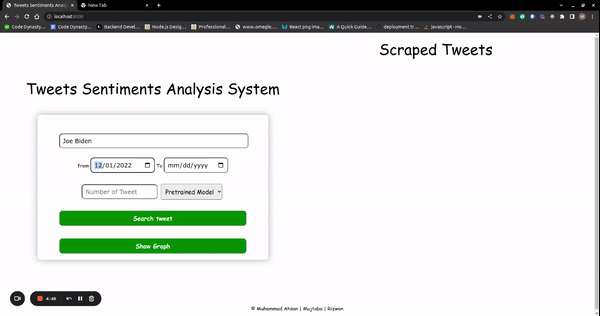

# **_Tweets Sentimental Analysis System._**

    The way individuals/People are expressing their feelings, thoughts and opinions have entirely transformed in the
    previous few years thanks to the discovery of social sites, websites, blogs, wikis, and other online cooperative media
    and web sources. The purification of data from the large amount of unstructured data on the Web can be a key feature for
    dealers/sealers who want to develop a mental model for customers of their product or brand. These operational social
    data, however, remain hardly reachable to machines, as they are exactly meant for human consumption.

## Proposed Methodology

    We are supposed to propose a system, which can detect if the given tweet is positive or negative, and how many people are in favor or opposition to that tweet(Topic like Machine Learning, Deep Learning and so on) .
    We are using python for data preprocessing, we’re using social networking services  snscrape which is a python based package used for fetching real time tweets, and for front end and python web integration we will be using Django.

## Dataset And Model Discussion

    We have used the dataset named Sentiment140 [2]. Which contains 1.6M tweets labelled data. And it is labelled with two classes Positive and negative. Which meet our requirements to use this dataset for training the model.
    We used Roberta pretrained as well as created our own model to analysis the tweets. obsviously at this level the roberta is performing much better than our model but we trying to make our model accurate and efficient as possible.

## How to Project?

* Clone the repository
* Download [models](https://drive.google.com/drive/folders/10gjjsie6qbcD_z2UIjxvnX3y9hSE9YA2?usp=share_link) zip file
  and extract
  in project folder.
* Run the `pip install -r requirements.txt` to install all packages in the project folder.
* To run application `python3 manage.py runserver`

## Live View

    

### References

    [1]	https://medium.com/mlearning-ai/tweets-sentiment-analysis-with-roberta-1f30cf4e1035
    [2]	https://www.kaggle.com/datasets/kazanova/sentiment140
    [3]	https://stackabuse.com/text-translation-with-google-translate-api-in-python/
    [4]	https://medium.com/dataseries/how-to-scrape-millions-of-tweets-using-snscrape-195ee3594721
    

    